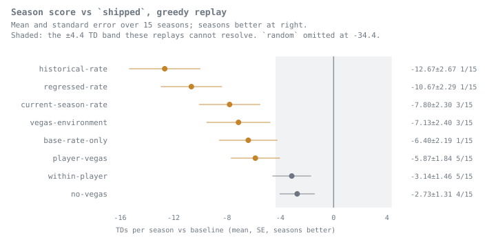
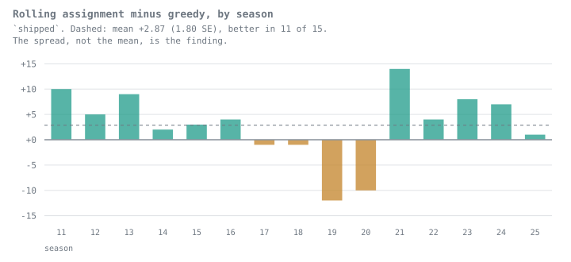

# Evaluation Report

Generated measurements and methodological notes. Interpretation is maintained separately in [the authored analysis](ANALYSIS.md), is tied to a named experiment, and is not updated by report generation. NA denotes an unavailable metric.

## Study Overview

Experiment: `roster-snapshot-repair`. Specification: 2026-09-04. Seasons: 2011, 2012, 2013, 2014, 2015, 2016, 2017, 2018, 2019, 2020, 2021, 2022, 2023, 2024, 2025.

Models: random, within-player, historical-rate, regressed-rate, current-season-rate, vegas-environment, player-vegas, shipped, no-vegas, base-rate-only. Baseline: `shipped`; shuffled seeds: [0, 1, 2, 3, 4, 5, 6, 7, 8, 9, 10, 11, 12, 13, 14, 15, 16, 17, 18, 19]; deterministic seed sentinel: -1. Policy: `historical`; roles: `usage`.

## Season Replay Results

Actual TDs per season from each model/strategy's own no-reuse history. Differences and paired SEs are relative to the baseline's greedy replay; seeds/trials are averaged within season before computing SEs across seasons.

| model | strategy | tds_per_season | se | shuffle_sd | delta_vs_baseline_greedy | paired_se |
| --- | --- | --- | --- | --- | --- | --- |
| base-rate-only | greedy | 47.3333 | 1.9314 | 0.0000 | -6.4000 | 2.1883 |
| base-rate-only | optimizer | 47.0667 | 1.9456 | 0.0000 | -6.6667 | 2.2332 |
| current-season-rate | greedy | 45.9333 | 1.7388 | 0.0000 | -7.8000 | 2.2995 |
| current-season-rate | optimizer | 46.6000 | 1.7776 | 0.0000 | -7.1333 | 1.9392 |
| hindsight | hindsight | 157.8000 | 1.6071 | 0.0000 | 104.0667 | 2.0412 |
| historical-rate | greedy | 41.0667 | 1.5871 | 0.0000 | -12.6667 | 2.6702 |
| historical-rate | optimizer | 40.9333 | 1.3955 | 0.0000 | -12.8000 | 2.3365 |
| no-vegas | greedy | 51.0000 | 2.1224 | 0.0000 | -2.7333 | 1.3146 |
| no-vegas | optimizer | 54.3333 | 2.2587 | 0.0000 | 0.6000 | 1.8944 |
| player-vegas | greedy | 47.8667 | 1.5083 | 0.0000 | -5.8667 | 1.8410 |
| player-vegas | optimizer | 47.8667 | 1.6786 | 0.0000 | -5.8667 | 1.8995 |
| random | greedy | 19.3133 | 0.5891 | 7.9100 | -34.4200 | 1.9876 |
| random | optimizer | 19.2067 | 0.5759 | 7.7321 | -34.5267 | 2.0465 |
| regressed-rate | greedy | 43.0667 | 1.9868 | 0.0000 | -10.6667 | 2.2922 |
| regressed-rate | optimizer | 42.7333 | 1.8758 | 0.0000 | -11.0000 | 2.1112 |
| shipped | greedy | 53.7333 | 2.3227 | 0.0000 | 0.0000 | 0.0000 |
| shipped | optimizer | 56.6000 | 2.4178 | 0.0000 | 2.8667 | 1.8044 |
| shipped | random | 46.7433 | 1.0796 | 6.9501 | -6.9900 | 2.1784 |
| vegas-environment | greedy | 46.6000 | 2.1620 | 0.0000 | -7.1333 | 2.3962 |
| vegas-environment | optimizer | 45.8667 | 2.2905 | 0.0000 | -7.8667 | 2.4453 |
| within-player | greedy | 50.3967 | 1.5679 | 5.0373 | -3.3367 | 1.4895 |
| within-player | optimizer | 50.1667 | 0.9766 | 5.9968 | -3.5667 | 1.8778 |

`replays.csv` records actual TDs, empty slots and unique players for every seed/trial and season; `picks.csv` records every choice. Hindsight uses actual scorer identities and the full feasible scoring history; it is a reference ceiling with a different candidate population.

## Ranking Diagnostics

Challenger minus baseline in the common pool: TDs per ranked candidate, not achieved season scores. SEs are across seasons.

| model | k | mean | se | shuffle_sd | seasons |
| --- | --- | --- | --- | --- | --- |
| base-rate-only | 1 | -0.0629 | 0.0435 | 0.0000 | 15 |
| base-rate-only | 3 | -0.0609 | 0.0216 | 0.0000 | 15 |
| base-rate-only | 5 | -0.0403 | 0.0185 | 0.0000 | 15 |
| base-rate-only | 10 | -0.0360 | 0.0089 | 0.0000 | 15 |
| current-season-rate | 1 | -0.0736 | 0.0416 | 0.0000 | 15 |
| current-season-rate | 3 | -0.1011 | 0.0222 | 0.0000 | 15 |
| current-season-rate | 5 | -0.1084 | 0.0190 | 0.0000 | 15 |
| current-season-rate | 10 | -0.1589 | 0.0150 | 0.0000 | 15 |
| historical-rate | 1 | -0.2956 | 0.0627 | 0.0000 | 15 |
| historical-rate | 3 | -0.2508 | 0.0331 | 0.0000 | 15 |
| historical-rate | 5 | -0.2050 | 0.0251 | 0.0000 | 15 |
| historical-rate | 10 | -0.1404 | 0.0147 | 0.0000 | 15 |
| no-vegas | 1 | -0.0368 | 0.0217 | 0.0000 | 15 |
| no-vegas | 3 | -0.0113 | 0.0153 | 0.0000 | 15 |
| no-vegas | 5 | -0.0116 | 0.0098 | 0.0000 | 15 |
| no-vegas | 10 | -0.0103 | 0.0042 | 0.0000 | 15 |
| player-vegas | 1 | -0.0293 | 0.0468 | 0.0000 | 15 |
| player-vegas | 3 | -0.0712 | 0.0282 | 0.0000 | 15 |
| player-vegas | 5 | -0.0594 | 0.0179 | 0.0000 | 15 |
| player-vegas | 10 | -0.0632 | 0.0111 | 0.0000 | 15 |
| random | 1 | -0.7094 | 0.0371 | 0.1378 | 15 |
| random | 3 | -0.6548 | 0.0221 | 0.0787 | 15 |
| random | 5 | -0.6130 | 0.0149 | 0.0565 | 15 |
| random | 10 | -0.5114 | 0.0120 | 0.0385 | 15 |
| regressed-rate | 1 | -0.0975 | 0.0572 | 0.0000 | 15 |
| regressed-rate | 3 | -0.1381 | 0.0199 | 0.0000 | 15 |
| regressed-rate | 5 | -0.1253 | 0.0144 | 0.0000 | 15 |
| regressed-rate | 10 | -0.1296 | 0.0120 | 0.0000 | 15 |
| vegas-environment | 1 | -0.2394 | 0.0480 | 0.0000 | 15 |
| vegas-environment | 3 | -0.1621 | 0.0223 | 0.0000 | 15 |
| vegas-environment | 5 | -0.1387 | 0.0138 | 0.0000 | 15 |
| vegas-environment | 10 | -0.0681 | 0.0085 | 0.0000 | 15 |
| within-player | 1 | -0.0341 | 0.0230 | 0.0928 | 15 |
| within-player | 3 | -0.0302 | 0.0117 | 0.0426 | 15 |
| within-player | 5 | -0.0246 | 0.0071 | 0.0282 | 15 |
| within-player | 10 | -0.0093 | 0.0050 | 0.0146 | 15 |

Per-seed coverage, jointly empty cells and per-season diagnostics are saved in `ranking.csv` and `paired_ranking.csv`. Across exported ranking metric rows: 0 empty cells (repeated across k, pools and seeds; not independent observations).

## Calibration Diagnostics

`shipped`; hard-eligible forecasts with positive lambda, including baseline-spent players. Separate diagnostic fits on each evaluated season: `E[Y] = exp(intercept) * lambda ** slope`. SEs use player-season clusters. These are in-sample diagnostic coefficients, not fitted correction artifacts. Intercept 0 and slope 1 define the identity reference; slope alone does not establish calibration. `dropped_zero_lam` counts excluded eligible zero forecasts.

| season | intercept | slope | se_intercept | se_slope | n | clusters | dropped_zero_lam |
| --- | --- | --- | --- | --- | --- | --- | --- |
| 2011 | -0.1351 | 0.8712 | 0.0432 | 0.0454 | 5468 | 408 | 0 |
| 2012 | -0.1240 | 0.8874 | 0.0469 | 0.0327 | 5456 | 407 | 0 |
| 2013 | -0.0739 | 0.8756 | 0.0324 | 0.0284 | 5559 | 406 | 0 |
| 2014 | -0.1420 | 0.8429 | 0.0411 | 0.0378 | 5497 | 408 | 0 |
| 2015 | -0.0687 | 0.8860 | 0.0555 | 0.0394 | 5250 | 404 | 0 |
| 2016 | -0.1392 | 0.8615 | 0.0370 | 0.0292 | 8155 | 844 | 0 |
| 2017 | -0.1583 | 0.8912 | 0.0377 | 0.0278 | 7926 | 644 | 0 |
| 2018 | -0.0865 | 0.8169 | 0.0421 | 0.0332 | 7699 | 652 | 0 |
| 2019 | -0.1146 | 0.8758 | 0.0346 | 0.0276 | 7118 | 639 | 0 |
| 2020 | -0.0255 | 0.8830 | 0.0334 | 0.0256 | 7229 | 675 | 0 |
| 2021 | -0.1636 | 0.8580 | 0.0338 | 0.0254 | 7611 | 715 | 0 |
| 2022 | -0.1662 | 0.8717 | 0.0321 | 0.0249 | 7532 | 664 | 0 |
| 2023 | -0.1276 | 0.8557 | 0.0421 | 0.0280 | 7507 | 647 | 0 |
| 2024 | -0.0845 | 0.8360 | 0.0445 | 0.0308 | 7506 | 651 | 0 |
| 2025 | -0.0912 | 0.8915 | 0.0331 | 0.0252 | 7514 | 663 | 0 |

Calibration slopes/intercepts, reliability bins, tail deviance and within-slot Spearman results are saved separately by model, seed and season in `calibration.csv`, `reliability.csv`, `deviance.csv` and `spearman.csv`.

## Methods And Limitations

- Scoring: one credit for each touchdown scored and each credited passing touchdown thrown; negated plays and conversions excluded; complete game coverage required.
- Historical: current-season closing lines for weeks >= decision week are masked before all team/league averages. Week one uses the shipped league fallback.
- Stats through W-1; weekly roster and injury rows through W; usage roles. Final schedule revisions, report timing within a week and later stat corrections remain approximations.
- One decision per week immediately before the first confirmed pick deadline. Unknown current-week kickoffs are hard exclusions; future planning estimates remain usable.
- Snapshot observations represent import availability, not backdated source publication. Finalized outcome scoring is separate from archived projection inputs.
- Ranking population: pool-position players listed active on their own team's latest weekly roster snapshot at or before the decision week, before assignment pruning; hard exclusions unranked. Zero estimates eligible. Ties use player ID.
- Common-pool depletion uses the selected deterministic baseline greedy history. Top-k diagnostics are TDs per ranked candidate, never achieved season scores.
- Slot-week means are averaged within season. Seeds are averaged within season before uncertainty across seasons; seed SD is reported separately. Empty cells are reported.
- Each greedy/optimizer replay has its own no-reuse history. Random-top-10 strategy trials use shipped forecasts and differ from shuffled projection models. Hindsight is retrospective.
- All seasons and era summaries are retrospective; neither era is an untouched holdout. Production constants are fixed; no calibration correction or tuning is applied.
- Research scoring includes the checked correction in experiments/scoring-corrections.json: duplicate rushing touchdowns in 2011_13_DET_NO reconciled to the official Saints game report.

The solver is exact for the pruned fixed matrix, which does not establish an advantage for its rolling policy. Forecast diagnostics are not evidence of an achieved season gain or simulation readiness. No production parameter was changed.

## Reproducibility And Verification

Artifact schema 1; scoring version 2; database schema 2.

Code revision `9b0525c86b59e15f9238a5fd01abe9f6ff824064`; source fingerprint `08886f8851956059ccb50dace43e2b8af4f0607f724ff8a5d14c04b6e82d5686`; dirty tree: True. Frozen dataset SHA-256 `405df67ac6a2d73b1036ffdd483b56f1e9745934af110a1730c84d6e7e93fdf2`.

Reproduce: `pool benchmark --config experiments/roster-snapshot-repair.toml --output data/experiments/roster-snapshot-repair --resume`. Checkpoints require matching code, configuration, dependencies and frozen dataset. Saved compact artifacts are in `experiments/results/roster-snapshot-repair`; detailed forecasts and future surfaces remain in the ignored output directory.

### Recorded Verification

Recorded metric implementation commit: `7a98f03150193572515617f29f60e635f21aedb9`. The original manifest records the metric source and dataset identities.

All 15 seasons completed: 720 model/seed/season runs, 5,045,952 forecast rows, 1,755 achieved season scores, and 91,260 individual replay picks. All 4,175 required games have complete scoring and player-stat coverage for both teams.

2022 includes 271 completed games; the [Bills–Bengals game was canceled](https://www.buffalobills.com/news/nfl-says-neutral-site-afc-championship-game-is-possible-bills-bengals-week-17-ga). Its absence from the final schedule is a historical-replay approximation.

Original verification record: 229 pytest tests passed. Lint: Ruff check passed. Formatting: Ruff format --check passed. These are recorded results, not checks executed by the presentation step.

Recorded checks:

- all configured models and seeds
- candidate/eligibility/depletion masks
- hard exclusions unranked
- explicit decision timestamps
- consistent finalized actuals
- no player reuse
- pick sums equal season scores
- unique-player counts
- forecast pick indicators match replays
- game coverage
- both teams player-stat coverage

The pinned dependencies and thread environment are recorded in the metric manifest; retain that environment when resuming model computation. See [experiment instructions](../experiments/README.md) for commands and schema.

### Presentation

Rendered from saved compact metrics; no forecasts, replays, or calibration fits were recomputed. `presentation.json` records the rendering-source hashes. The metric manifest and original verification record are unchanged.
