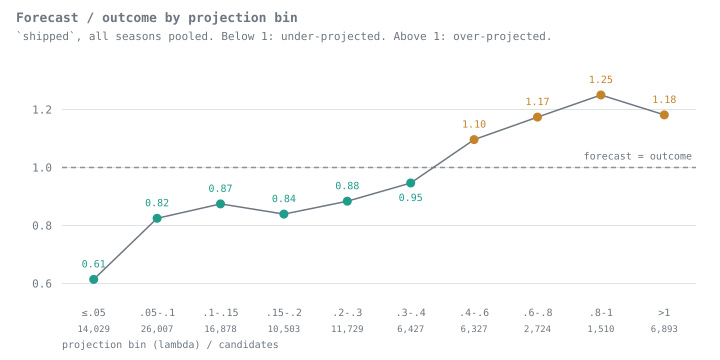
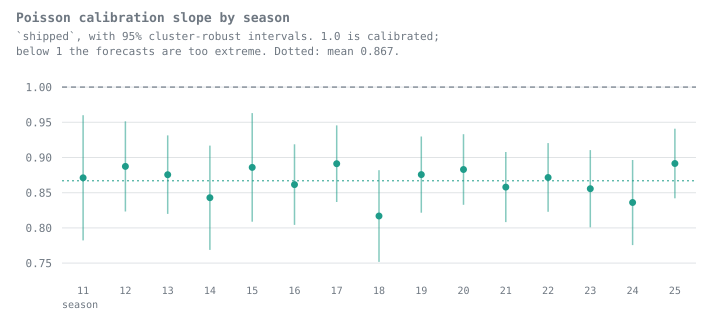

# Corrected projection benchmark

Specification: 2026-09-04. Artifact schema 1; scoring version 2; database schema 2.

Code revision `9b0525c86b59e15f9238a5fd01abe9f6ff824064`; source fingerprint `08886f8851956059ccb50dace43e2b8af4f0607f724ff8a5d14c04b6e82d5686`; dirty tree: True. Frozen dataset SHA-256 `405df67ac6a2d73b1036ffdd483b56f1e9745934af110a1730c84d6e7e93fdf2`.

Models: random, within-player, historical-rate, regressed-rate, current-season-rate, vegas-environment, player-vegas, shipped, no-vegas, base-rate-only. Baseline: `shipped`; shuffled seeds: [0, 1, 2, 3, 4, 5, 6, 7, 8, 9, 10, 11, 12, 13, 14, 15, 16, 17, 18, 19]; deterministic seed sentinel: -1. Policy: `historical`; roles: `usage`.

Reproduce: `pool benchmark --config experiments/roster-snapshot-repair.toml --output data/experiments/roster-snapshot-repair --resume`. Checkpoints require matching code, configuration, dependencies and frozen dataset. Saved compact artifacts are in `experiments/results/roster-snapshot-repair`; detailed forecasts and future surfaces remain in the ignored output directory.

- Scoring: one credit for each touchdown scored and each credited passing touchdown thrown; negated plays and conversions excluded; complete game coverage required.
- Historical: current-season closing lines for weeks >= decision week are masked before all team/league averages. Week one uses the shipped league fallback.
- Stats through W-1; weekly roster and injury rows through W; usage roles. Final schedule revisions, report timing within a week and later stat corrections remain approximations.
- One decision per week immediately before the first confirmed pick deadline. Unknown current-week kickoffs are hard exclusions; future planning estimates remain usable.
- Snapshot observations represent import availability, not backdated source publication. Finalized outcome scoring is separate from archived projection inputs.
- Ranking population: pool-position players listed active on their own team's latest weekly roster snapshot at or before the decision week, before assignment pruning; hard exclusions unranked. Zero estimates eligible. Ties use player ID.
- Common-pool depletion uses the selected deterministic baseline greedy history. Top-k diagnostics are TDs per ranked candidate, never achieved season scores.
- Slot-week means are averaged within season. Seeds are averaged within season before uncertainty across seasons; seed SD is reported separately. Empty cells are reported.
- Each greedy/optimizer replay has its own no-reuse history. Random-top-10 strategy trials use shipped forecasts and differ from shuffled projection models. Hindsight is retrospective.
- All seasons and era summaries are retrospective; neither era is an untouched holdout. Production constants are fixed; no calibration correction or tuning is applied.
- Research scoring includes the checked correction in experiments/scoring-corrections.json: duplicate rushing touchdowns in 2011_13_DET_NO reconciled to the official Saints game report.

## What the diagnostics show

`shipped`'s Poisson calibration slope is 0.817-0.892 in all 15 seasons (mean 0.867, SD 0.022). A slope below 1 means the forecasts are too extreme: the spread between high and low estimates is wider than the outcomes justify. The season-to-season spread is small next to the gap from 1, so this is a standing property of the model rather than a season effect.

No challenger ranks better than `shipped` at any reported k: every paired common-pool difference is negative. The bake-off does not identify a better functional form among the alternatives tried, which is not the same as showing the available inputs are exhausted.

Across the 7 candidate models, excluding the shuffled nulls, the common-pool top-10 diagnostic orders models much as their achieved season scores do (Spearman 0.86), but it does not convert into them: scaled by the 52 picks in a season it recovers about 59% of the season difference. Use it to rank candidates, never to quote a season gain.

## Common-pool paired ranking diagnostics

Challenger minus baseline, TDs per ranked candidate; SE across seasons.

| model | k | mean | se | shuffle_sd | seasons |
| --- | --- | --- | --- | --- | --- |
| base-rate-only | 1 | -0.0629 | 0.0435 | 0.0000 | 15 |
| base-rate-only | 3 | -0.0609 | 0.0216 | 0.0000 | 15 |
| base-rate-only | 5 | -0.0403 | 0.0185 | 0.0000 | 15 |
| base-rate-only | 10 | -0.0360 | 0.0089 | 0.0000 | 15 |
| current-season-rate | 1 | -0.0736 | 0.0416 | 0.0000 | 15 |
| current-season-rate | 3 | -0.1011 | 0.0222 | 0.0000 | 15 |
| current-season-rate | 5 | -0.1084 | 0.0190 | 0.0000 | 15 |
| current-season-rate | 10 | -0.1589 | 0.0150 | 0.0000 | 15 |
| historical-rate | 1 | -0.2956 | 0.0627 | 0.0000 | 15 |
| historical-rate | 3 | -0.2508 | 0.0331 | 0.0000 | 15 |
| historical-rate | 5 | -0.2050 | 0.0251 | 0.0000 | 15 |
| historical-rate | 10 | -0.1404 | 0.0147 | 0.0000 | 15 |
| no-vegas | 1 | -0.0368 | 0.0217 | 0.0000 | 15 |
| no-vegas | 3 | -0.0113 | 0.0153 | 0.0000 | 15 |
| no-vegas | 5 | -0.0116 | 0.0098 | 0.0000 | 15 |
| no-vegas | 10 | -0.0103 | 0.0042 | 0.0000 | 15 |
| player-vegas | 1 | -0.0293 | 0.0468 | 0.0000 | 15 |
| player-vegas | 3 | -0.0712 | 0.0282 | 0.0000 | 15 |
| player-vegas | 5 | -0.0594 | 0.0179 | 0.0000 | 15 |
| player-vegas | 10 | -0.0632 | 0.0111 | 0.0000 | 15 |
| random | 1 | -0.7094 | 0.0371 | 0.1378 | 15 |
| random | 3 | -0.6548 | 0.0221 | 0.0787 | 15 |
| random | 5 | -0.6130 | 0.0149 | 0.0565 | 15 |
| random | 10 | -0.5114 | 0.0120 | 0.0385 | 15 |
| regressed-rate | 1 | -0.0975 | 0.0572 | 0.0000 | 15 |
| regressed-rate | 3 | -0.1381 | 0.0199 | 0.0000 | 15 |
| regressed-rate | 5 | -0.1253 | 0.0144 | 0.0000 | 15 |
| regressed-rate | 10 | -0.1296 | 0.0120 | 0.0000 | 15 |
| vegas-environment | 1 | -0.2394 | 0.0480 | 0.0000 | 15 |
| vegas-environment | 3 | -0.1621 | 0.0223 | 0.0000 | 15 |
| vegas-environment | 5 | -0.1387 | 0.0138 | 0.0000 | 15 |
| vegas-environment | 10 | -0.0681 | 0.0085 | 0.0000 | 15 |
| within-player | 1 | -0.0341 | 0.0230 | 0.0928 | 15 |
| within-player | 3 | -0.0302 | 0.0117 | 0.0426 | 15 |
| within-player | 5 | -0.0246 | 0.0071 | 0.0282 | 15 |
| within-player | 10 | -0.0093 | 0.0050 | 0.0146 | 15 |

Per-seed coverage, jointly empty cells and per-season diagnostics are saved in `ranking.csv` and `paired_ranking.csv`. Across exported ranking metric rows: 0 empty cells (repeated across k, pools and seeds; not independent observations). Calibration slopes/intercepts, reliability bins, tail deviance and within-slot Spearman results are saved separately by seed and season. They are diagnostics, not evidence of an achieved season gain or simulation readiness.

## Run verification

Implementation commit matching every recorded source-file hash: `7a98f03150193572515617f29f60e635f21aedb9`. The run began from that source tree before its implementation commit; the manifest preserves the original parent revision and dirty fingerprint.

All 15 seasons completed: 720 model/seed/season runs, 5,045,952 forecast rows, 1,755 achieved season scores, and 91,260 individual replay picks. All 4,175 required games have complete scoring and player-stat coverage for both teams. No season was omitted.

2022 includes 271 completed games; the [Bills–Bengals game was canceled](https://www.buffalobills.com/news/nfl-says-neutral-site-afc-championship-game-is-possible-bills-bengals-week-17-ga). Its absence from the final schedule is a historical-replay approximation.

Verification: 229 pytest tests passed; Ruff lint and formatting passed. Saved forecasts were checked for identical candidate/mask populations, hard exclusions, timestamps and outcomes. Pick histories contain no player reuse; pick sums equal reported scores; selected-player flags and unique-player counts reconcile. A full `--resume` verified all checkpoint hashes. Synthetic interrupted/resumed and uninterrupted runs produced identical artifacts.

This run used `OPENBLAS_NUM_THREADS=1 OMP_NUM_THREADS=1`; keep these environment variables when resuming. The pinned dependencies and exact environment are recorded in the manifest. See [experiment instructions](../../README.md) for the full command and schema. Reports are generated from saved metrics and this verification record.
